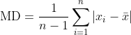

# Notes

Express features in terms of a z-score (standardized around 0 and scaled by
the standard deviation). Only, instead of `stdev` use **absolute mean
deviation**.

1. Compute the mean for all values in the column
2. Compute MD for each column: 

3. For each value in the column, compute the "z-score" as 
`z = (value - mean) / MD`

And as an SVG instead of GIF:

